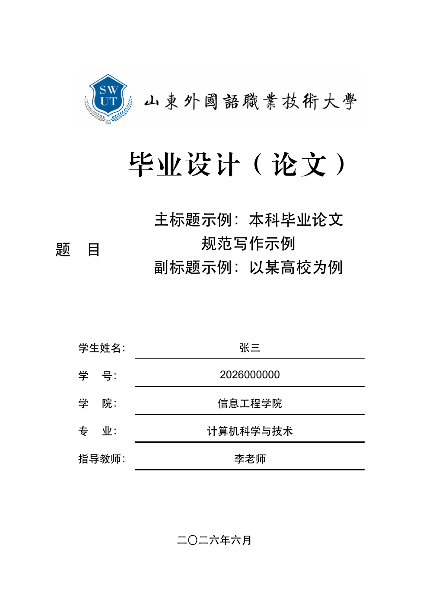
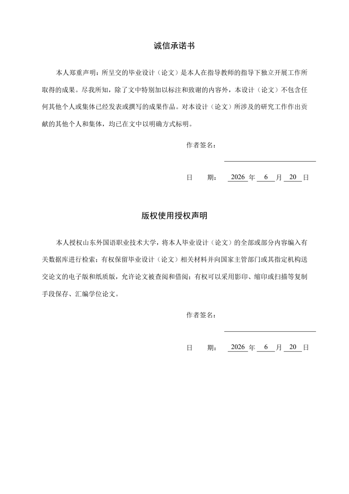
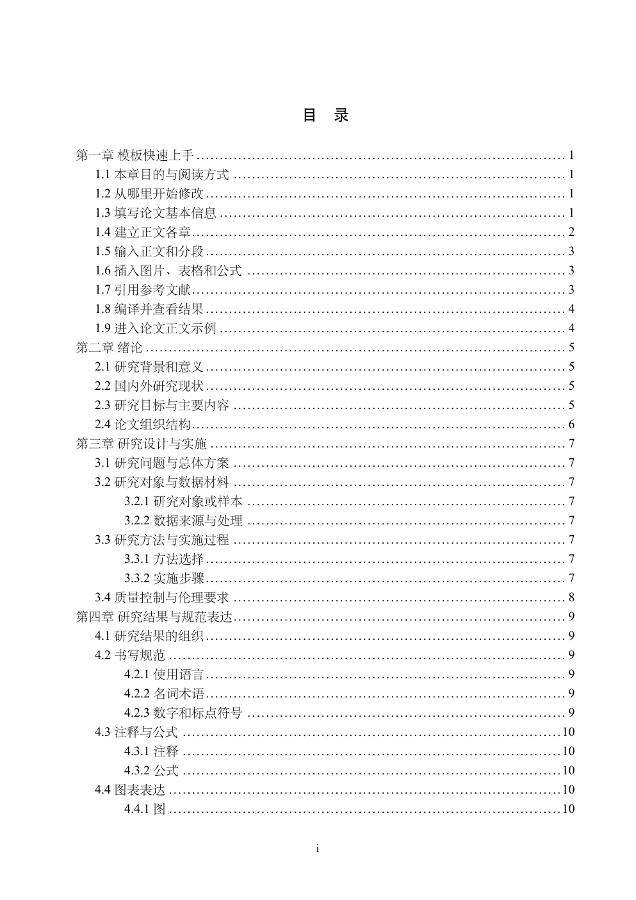
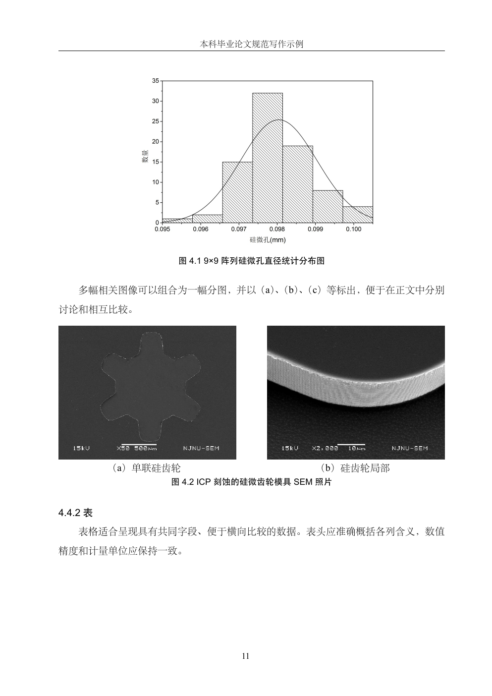
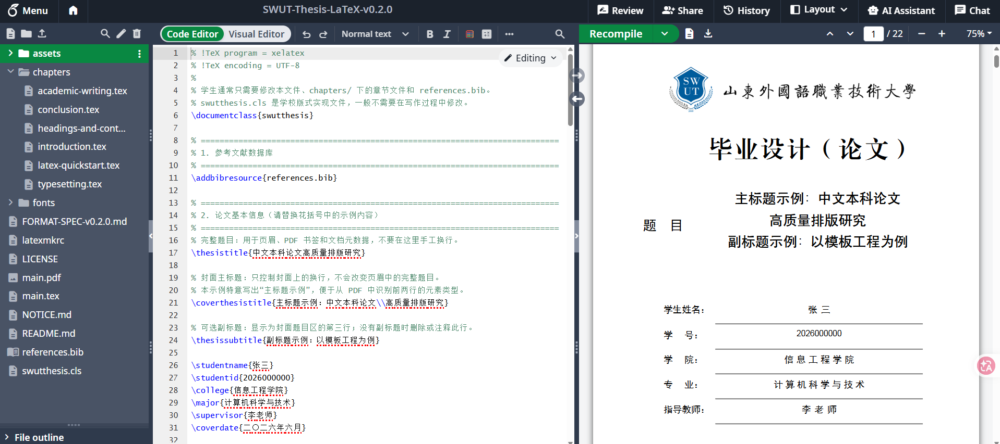
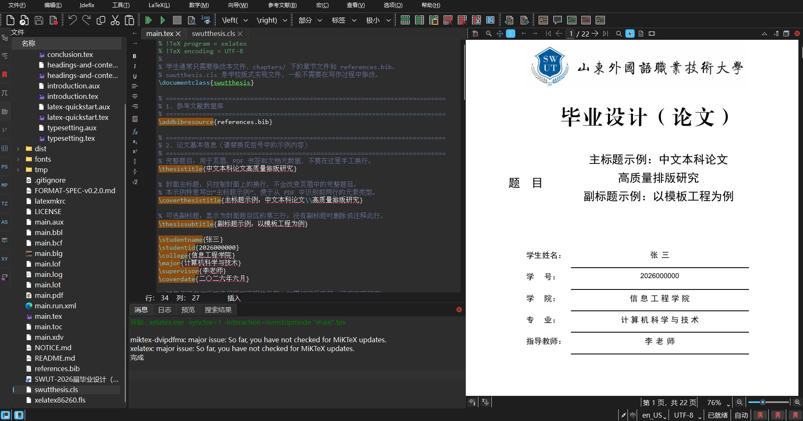

<div align="center">

# 山东外国语职业技术大学本科毕业设计（论文）LaTeX 模板

**面向全校本科生的中文毕业设计（论文）排版模板**

[](https://gitee.com/typicalspider/swut-thesis-latex/releases)
[](#编译器要求)
[](#快速开始推荐使用中国科技云)
[](LICENSE)

[完整示例 PDF](main.pdf) ·
[Gitee 发行版](https://gitee.com/typicalspider/swut-thesis-latex/releases) ·
[GitHub Releases](https://github.com/typicalspider98/swut-thesis-latex/releases)

</div>

本项目以学校发布的
`SWUT-2026届毕业设计（论文）格式模板网站公布版.docx`
为排版规范来源，面向中文本科毕业设计（论文）。模板统一处理封面、
声明、摘要、目录、正文、图表、参考文献、致谢和附录等版式，使用者
主要填写论文信息与内容，无需逐项手工调整字体、字号和行距。

学校 Word 原始模板只用于开发校对，不纳入公开 Git 仓库和发行包；
公开项目保留依据该文件整理的格式基线和自主编写的 LaTeX 实现。

## 模板预览

<table>
  <tr>
    <td align="center" width="25%">
      <a href="docs/images/readme/preview-cover.png">
        
      </a>
      <br><sub>论文封面</sub>
    </td>
    <td align="center" width="25%">
      <a href="docs/images/readme/preview-declaration.png">
        
      </a>
      <br><sub>承诺书与授权声明</sub>
    </td>
    <td align="center" width="25%">
      <a href="docs/images/readme/preview-contents.png">
        
      </a>
      <br><sub>自动生成的目录</sub>
    </td>
    <td align="center" width="25%">
      <a href="docs/images/readme/preview-figures.png">
        
      </a>
      <br><sub>图片、表格与正文</sub>
    </td>
  </tr>
</table>

<p align="center">
  点击缩略图可查看原图，完整排版效果请查看
  <a href="main.pdf"><strong>main.pdf</strong></a>。
</p>

## 编译器要求

**本模板必须使用 XeLaTeX 编译，不能使用 pdfLaTeX。** 模板依赖
XeLaTeX 对 UTF-8 中文、系统字体及 OpenType/TrueType 字体的支持；
使用 pdfLaTeX 会直接停止编译。项目中的 `latexmkrc` 已设置为调用
XeLaTeX 和 Biber。系统已安装 `latexmk` 时，可在本地运行
`latexmk main.tex`；未安装时使用下文列出的四步手动编译流程。

## 快速开始（推荐使用中国科技云）

无需在电脑上安装 LaTeX 环境。请先从
[Gitee 发行版页面](https://gitee.com/typicalspider/swut-thesis-latex/releases)
或
[GitHub Releases](https://github.com/typicalspider98/swut-thesis-latex/releases)
下载最新版本的 ZIP 压缩包，然后将 ZIP 直接导入在线 LaTeX 平台。
不要先解压后逐个上传文件，否则容易遗漏目录或资源文件。

### 使用中国科技云论文协同编辑服务

登录[中国科技云论文协同编辑服务](https://latex.cstcloud.cn/)后，按照
平台提示上传模板 ZIP。导入后打开项目设置，将 **Compiler** 设置为
**XeLaTeX**，主文档设置为 `main.tex`，然后执行编译。该服务可使用
微信扫码登录，服务介绍见
[中国科技云资源页面](https://www1.cstcloud.cn/resources/452)。

在线平台的默认编译器可能是 pdfLaTeX。首次导入后必须先检查项目设置，
确认已经选择 **XeLaTeX**，再开始编译。

### 关于 Overleaf

本模板原则上可以导入 Overleaf，并仍须选择 XeLaTeX；但完整示例需要
加载中文字体、参考文献和图表等组件，可能超过 Overleaf 免费计划的
编译时限。该限制属于平台资源配额，并不表示 LaTeX 源文件存在编译
错误。需要稳定完成全文编译时，建议优先使用中国科技云或本地环境。
Overleaf 各计划的编译时限以其
[官方说明](https://docs.overleaf.com/getting-started/free-and-premium-plans/plan-limits)
为准。

导入并编译成功后：

1. 修改 `main.tex` 第 2 区的论文题目、作者、学院、专业等信息。
   `\thesistitle` 保存用于页眉、书签等位置的完整题目；封面需要指定
   换行时，使用 `\coverthesistitle{第一行\\第二行}`；可选的第三行
   使用 `\thesissubtitle{副标题}`，没有副标题时删除或注释该命令。
   诚信承诺书和版权使用授权声明的日期分别使用
   `\commitmentdate{年}{月}{日}` 与
   `\authorizationdate{年}{月}{日}` 填写；需要打印后手写时将三个
   参数留空即可。
   示例 PDF 中已直接标注“主标题示例”和“副标题示例”，便于辨认。
2. 在 `chapters/` 中撰写正文，在 `references.bib` 中维护参考文献。
   第一章“模板快速上手”说明了新建章节、正文分段、插图、引用和
   编译的推荐写法；正式提交论文时可删除该教程章。

## 使用界面

下图展示在线平台与本地编辑器中的典型工作界面。中国科技云论文协同
编辑服务基于开源版 Overleaf 定制研发，因此界面布局与操作方式基本
一致。图片可点击放大。

<table>
  <tr>
    <th width="50%">
      <a href="https://gitee.com/link?target=https%3A%2F%2Flatex.cstcloud.cn%2F">中国科技云论文协同编辑服务（Overleaf）</a>
    </th>
    <th width="50%">TeXstudio 本地编译</th>
  </tr>
  <tr>
    <td>
      <a href="docs/images/readme/overleaf-workspace.png">
        
      </a>
    </td>
    <td>
      <a href="docs/images/readme/texstudio-workspace.png">
        
      </a>
    </td>
  </tr>
  <tr>
    <td align="center"><sub>上传发行版 ZIP，选择 XeLaTeX 后在线编译</sub></td>
    <td align="center"><sub>配合 MiKTeX 完成本地编辑、编译和 PDF 预览</sub></td>
  </tr>
</table>

## 本地编译（可选）

在 Windows 系统中，建议配合 MiKTeX 与 TeXstudio 使用：

- [MiKTeX](https://miktex.org/download) 是 TeX 发行版，提供 XeLaTeX、
  Biber、宏包管理器以及生成 PDF 所需的基础组件。Windows 用户可下载
  **Basic Installer** 完成安装。
- [TeXstudio](https://www.texstudio.org/) 是集成式 LaTeX 编辑器，提供
  语法高亮、命令补全、错误定位、内置 PDF 查看器以及源代码与 PDF
  双向定位等功能。

MiKTeX 负责提供编译器和宏包，TeXstudio 负责编辑源文件并调用编译
工具。TeXstudio 本身不包含完整的 TeX 编译环境，因此应先安装
MiKTeX，再安装 TeXstudio。

完成安装后，建议进行以下配置：

1. 打开 MiKTeX Console，检查并安装可用更新。
2. 在 MiKTeX Console 中启用缺失宏包的自动安装功能。首次编译本模板
   时，MiKTeX 将按需安装 `ctex`、`biblatex` 和
   `biblatex-gb7714-2015` 等宏包。
3. 打开 TeXstudio 的构建设置，将默认编译器设为 **XeLaTeX**，将默认
   参考文献工具设为 **Biber**。
4. 使用 TeXstudio 打开项目根目录中的 `main.tex`，然后执行构建。

如果已经安装并配置好 `latexmk`，也可以在项目根目录通过命令行
完成自动编译：

```powershell
latexmk main.tex
```

部分 MiKTeX Basic 环境没有预装可直接使用的 `latexmk`。此时可依次
运行以下命令，编译结果与自动流程一致：

```powershell
xelatex main.tex
biber main
xelatex main.tex
xelatex main.tex
```

生成文件为 `main.pdf`。

## 字体获取与本地使用

公开发行包不直接附带第三方字体文件。需要完整复现学校 Word 模板时，
请从字体厂商官方渠道取得字体，并将文件放入项目的 `fonts/` 目录。

- [方正公文写作个人（家庭）版](https://shop.foundertype.com/index.php/AuthOffice/index.html)
  包含方正小标宋简体、仿宋_GB2312 和楷体_GB2312，适用于个人
  非商业的文档编辑、显示和打印。
- [方正小标宋官方字体页面](https://www.foundertype.com/index.php/FontInfo/index/id/164)
  提供字体介绍、个人非商业授权说明和官方获取入口。

取得字体后，按照 [`fonts/README.md`](fonts/README.md) 中的文件名放置。
本地编译时模板会自动读取排版所需的本地字体。中国科技云等在线平台
的用户可将依法取得的字体上传到自己的私人项目 `fonts/` 目录；
不要将字体文件提交到公开仓库或可公开访问的在线项目。

Windows 自带的仿宋和楷体信息可参阅 Microsoft 官方的
[FangSong](https://learn.microsoft.com/en-ie/typography/font-list/fangsong)
和 [KaiTi](https://learn.microsoft.com/en-us/typography/font-list/kaiti)
页面。系统字体与旧版 `_GB2312` 文件并非同一个字体文件，模板会根据
实际可用字体自动选择或回退。

当 `FZXBS.ttf` 缺失时，模板仍会生成 PDF，但会在封面固定标题下方
显示红色字体提示，明确指出当前使用了回退字体以及应放入
`fonts/` 目录的文件名。缺少学校版式使用的中西文字体时，封面底部
也会显示相应提示。字体补齐并重新编译后，这些提示会自动消失，避免
误将使用回退字体的草稿作为正式论文提交。

## 已实现的版式与功能

- 中文正文优先使用宋体，标题优先使用黑体。
- 西文和数字优先使用 Times New Roman，图表题中的西文优先使用 Arial。
- 封面校徽和手写校名使用从 Word 原组合对象直接导出的单张图片，
  按 Word 中的 397.95 pt × 83.45 pt 原尺寸放置，不使用文字重排校名。
- 诚信承诺书和版权使用授权声明按照 Word 原模板合排在同一页，
  两组正文、签名栏和日期栏均保留。
- 中英文摘要均强制设置 2 字符首行缩进和精确 1.5 倍行距；中英文
  关键词命令会检查关键词数量是否处于 3～5 个范围。
- 目录条目使用宋体小四号、18 磅行距，显示到三级标题；章、节和小节
  条目均使用密集点线连接页码，末端点线紧接页码并保持页码右对齐；
  图表清单的编号与标题也使用约 3 磅间隔。
- 正文为宋体小四号、约 23.4 磅基线距、首行缩进 24 磅；一级、二级和三级
  标题分别使用黑体小三、黑体四号和黑体小四号。各级标题编号与
  标题文字之间统一使用约 3 磅的普通空格。模板不设四级标题，
  “（1）”形式统一作为正文列表处理。
- 图、表和代码块在放不下时会整体转入下一页，并自动阻止后续段落
  越过它们提前排版，保证最终 PDF 与源文件的阅读顺序一致。
- 正文版心底部预留 0.3 cm 安全区，页码基线始终保持在距纸张底边
  约 1.5 cm 的固定位置，不随奇偶页或页面内容变化。
- 普通三线表使用 `swuttabular`，表格横线固定与正文版心等宽；表题
  与表格、代码块与相邻正文之间不再叠加额外空行，均按正文行距衔接。
- 跨页长表格使用 `swutlongtable`；续页自动沿用原表序号，并可重复
  表名和标题行，图表清单中不会生成重复条目。
- 致谢标题中保留两个汉字宽度的间隔，致谢正文与普通正文采用相同的
  字体、行距和首行缩进；附录标题沿用一级标题格式。
- 示例工程包含六章：第一章提供模板快速上手说明，后续章节依照
  绪论、研究设计、结果表达、讨论和总结的论文写作逻辑给出内容建议，
  并演示图表、公式、脚注、程序代码、参考文献、致谢和附录。
- “毕业设计（论文）”在本地提供相应字体时使用 Word 原模板指定的
  方正小标宋简体 36 磅，否则使用宋体回退并在 PDF 中显示提醒。
- 如果目标机器缺少 Windows 字体，模板会回退到 TeX Live 自带的
  Fandol 和 TeX Gyre 字体并显示提醒，保证草稿仍可编译；正式提交前
  应补齐字体并在学校指定环境中核对版式。
- 中文字体由模板在每轮 XeLaTeX 中统一初始化一次，不再先加载 CTeX
  默认字体后重复覆盖；字体探测结果在同一轮中复用。该优化不改变
  学生的编译操作，也不改变模板选用的字体和最终版式。
- 公开仓库暂不附带第三方字体文件；确认再分发授权后方可加入发布包。
  字体可从上述官方渠道取得，并按照 `fonts/README.md` 放入本地项目。

## 使用提示

- `main.tex`、`chapters/` 和 `references.bib` 是日常写作的主要编辑位置；
  `swutthesis.cls` 用于统一控制版式，通常不需要修改。
- 示例中的题目、摘要、正文、参考文献、致谢和附录均应替换为实际内容。
- 一位指导教师使用 `\supervisor{李老师}`；两位指导教师使用
  `\supervisor{李明,王小华}`。模板会将两人上下排列，并自动为两字
  姓名增加一个汉字宽度的间隔。
- 正文并列项目使用 `enumerate` 环境生成“（1）”编号，不要将
  `\subsubsection` 当作四级标题使用。
- 图、表、公式、代码块和参考文献均使用模板已有的示例结构；不手工
  设置字号、行距、页码、目录点线或编号。
- 正式提交前，建议在学校指定的字体环境中重新编译并核对最终 PDF。

## 目录结构

```text
.
├─ assets/                  校徽等资源
├─ chapters/                正文章节
├─ docs/images/readme/      README 使用的模板与编辑界面预览图
├─ fonts/                   可选字体的放置说明（公开仓库不附字体文件）
├─ .gitignore               编译产物、私有字体与校内原稿的忽略规则
├─ swutthesis.cls           模板类文件
├─ main.tex                 完整示例
├─ references.bib           参考文献数据库
├─ latexmkrc                自动化编译配置
└─ FORMAT-SPEC-v0.2.0.md    从 Word 模板提取的格式基线
```

## 版本记录

- **v0.2.4（2026-07-29）**：修复全局 `Scale=MatchLowercase` 导致中西文
  字体被自动缩小的问题，统一按 `Scale=1` 输出学校 Word 模板规定的
  物理字号；摘要标题、关键词、正文及页眉页脚不再因字体字面高度而
  产生额外缩放；修复目录点线在页码盒中重复绘制造成的间距异常，
  并使末尾点线紧贴页码；
  收紧双导师姓名行距，并保持姓名与下划线的视觉留白。
- **v0.2.3（2026-07-28）**：更正学校英文名称；将快速上手调整为第一章，
  依据学校 Word 模板重写中英文摘要和正文写作提示；增加字体回退的
  PDF 可见提醒，统一页眉为宋体五号、单倍行距；补充 MiKTeX 手动编译
  流程；公开仓库移除学校 Word 原始模板，并完善发行 ZIP 中的 README
  图片和忽略规则。
- **v0.2.2（2026-07-27）**：重构 XeLaTeX 字体初始化流程，避免 CTeX
  默认中文字体与模板字体重复加载，复用西文字体探测结果；保持原有
  用户命令、字体选择和 PDF 版式不变，降低在线平台和本地环境中每轮
  编译的初始化开销。
- **v0.2.1（2026-07-27）**：补充诚信承诺书和版权使用授权声明的日期
  命令，支持直接填写或留空手写；隐藏声明页签名提示文字，微调封面
  信息栏线条，并补充方正字体的官方获取与本地放置说明；增加 GitHub
  Release 下载入口。
- **v0.2.0（2026-07-24）**：完善封面、声明、摘要、目录、图表、公式、
  参考文献、致谢和附录；补充模板快速上手章节，统一代码块排版和分页
  行为；明确 XeLaTeX 编译要求和在线平台使用方式，清理已知的 xeCJK
  字体重定义警告，并更新公开格式基线说明；提供可直接导入 Overleaf
  和中国科技云论文协同编辑服务的 ZIP 发行包。
- **v0.1**：完成项目框架和 Word 模板主要版式规则的初步实现。

本项目从 v0.2.0 起遵循
[语义化版本 2.0.0](https://semver.org/lang/zh-CN/)；主版本号为 0
表示模板仍处于持续完善阶段。
